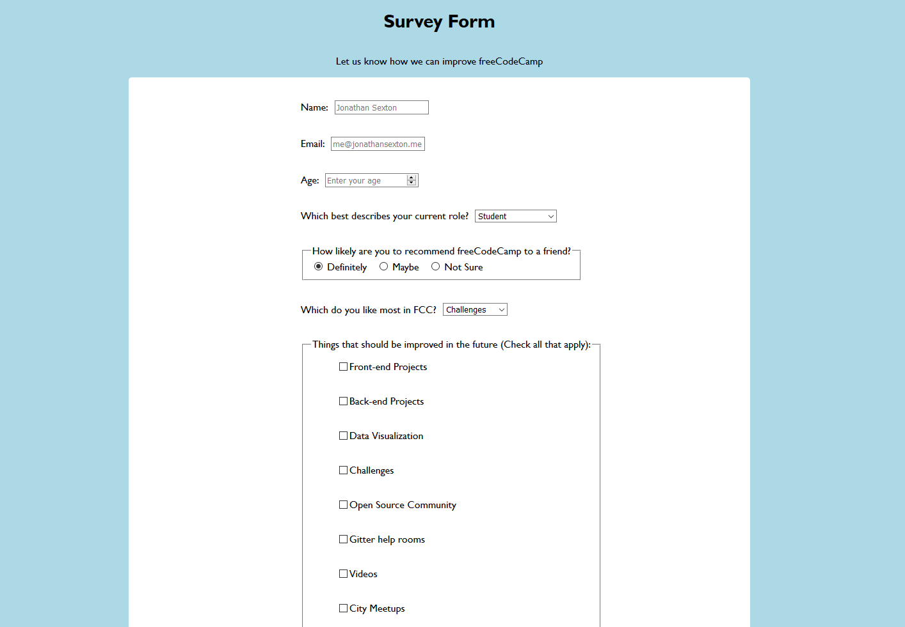

### freeCodeCamp Survey Form
This is the second project in fCC's Responsive Web Design cirriculum.  It is focused on applying good practices and techniques in regard to basic HTML and CSS (which this is built upon).  

Here is a [live version of the form](https://codepen.io/JS-goose/full/oQXeXr/) (front-end only).

If you are in need of a basic form by all means use this if you'd like just ensure to credit the appropriate source.  The questions/answers can be changed by editing the `index.html` file.  Styles (color/font) can be changed by editing the `styles.css` file.  

Here is an image of the survey form: 

Licensed under the [MIT License](https://github.com/JS-goose/Projects/blob/master/LICENSE)