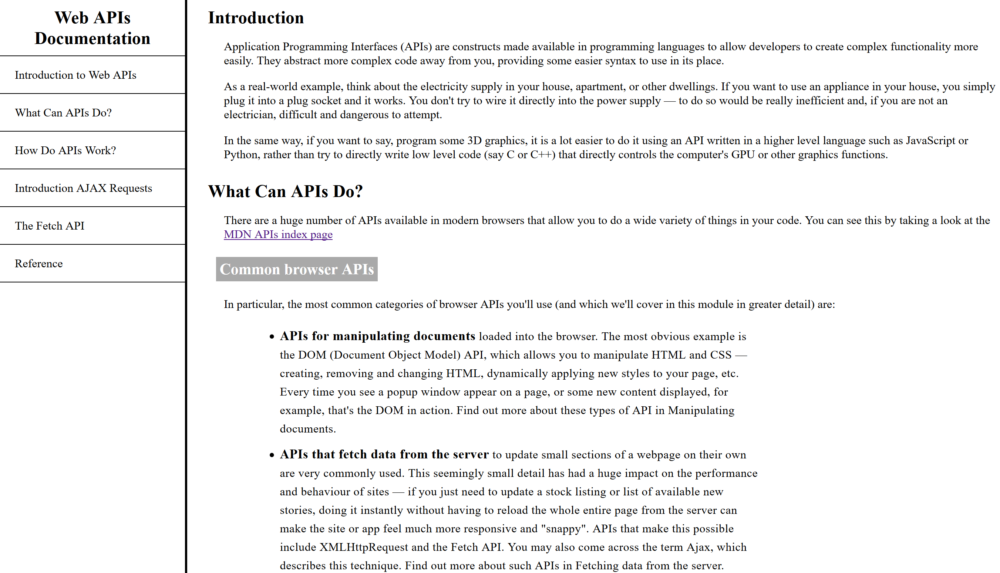

### freeCodeCamp Technical Documentation Page
This is the fourth project in fCC's Responsive Web Design curriculum.  It is focused on applying good practices and techniques in regard to basic HTML and CSS (which this is built upon).  

Here is a [live version of the page](https://codepen.io/JS-goose/full/bQWjLV/).

Here is an image of the page:  

Licensed under the [MIT License](https://github.com/JS-goose/Projects/blob/master/LICENSE)

https://js-goose.github.io/mws-restaurant-stage-1/data/restaurants.json