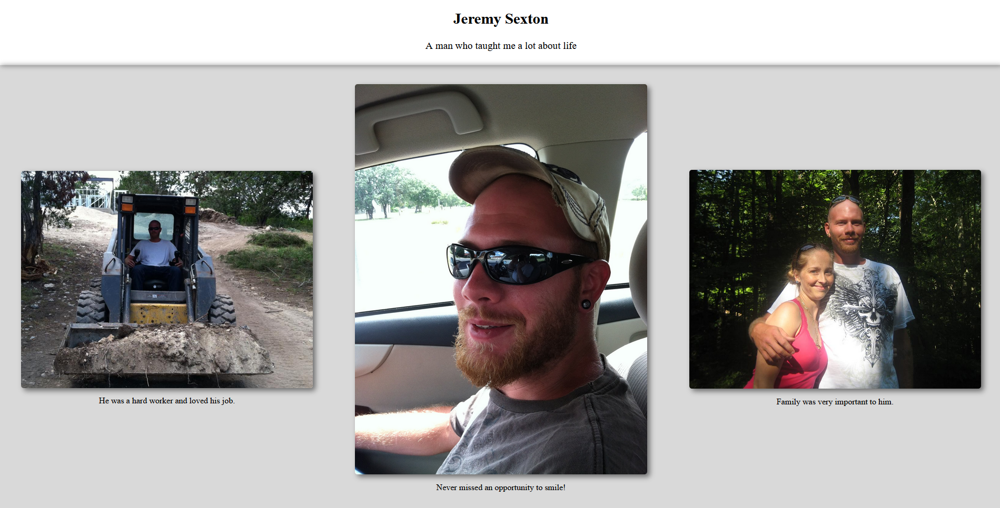

### fCC Tribute Page

This is the tribute page I built as part of the ***Responsive Web Design Projects*** in freeCodeCamp cirriculum.  It is fully responsive and works on all screen sizes.

It was built with: 

* HTML
* CSS (Grid and Flexbox)

No external libraries/frameworks were used, I coded everything manually.

There is a folder entitled `v1` which contains all of the files for the project before I reworked it.  The original (`v1`) was built _before_ fCC revamped their platform.

If you'd like to learn more visit <a href="https://www.freecodecamp.org" target="_blank">FreeCodeCamp</a> and get started learning to code today!

Below is a preview of my page.  It was built for my brother, Jeremy, who we lost in 2013.  

